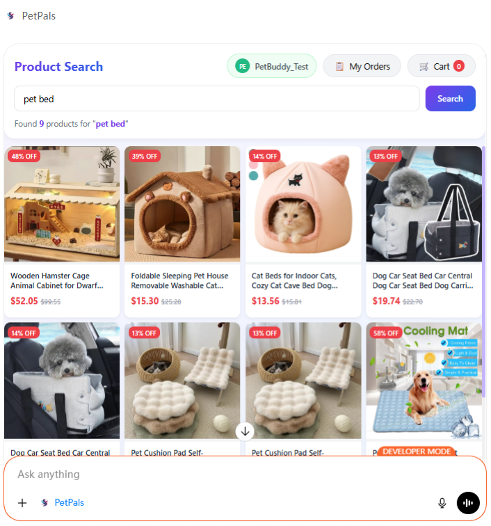
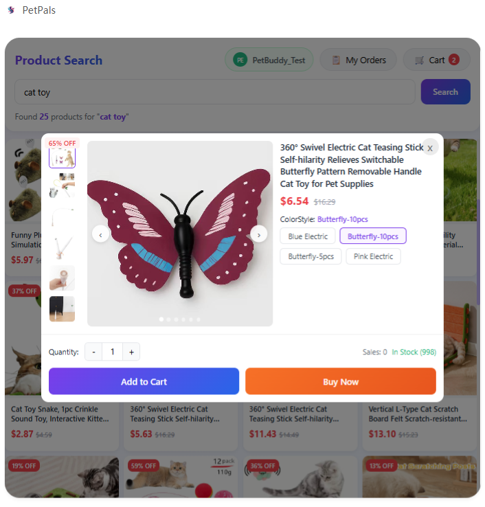
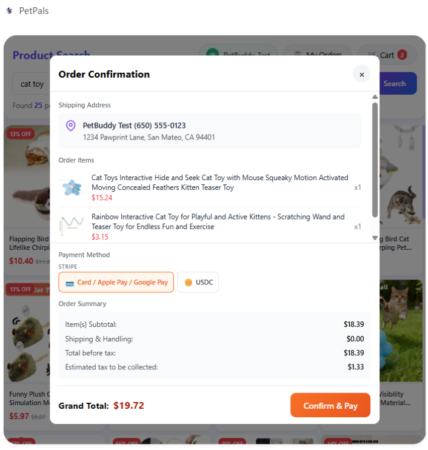

# PetPals — ChatGPT App Listing

A snapshot of the public ChatGPT app store page for PetPals. Source: [chatgpt.com/apps/petpals](https://chatgpt.com/apps/petpals/asdk_app_697047972e8c8191a13a465c9480d508) (saved HTML in this directory).

---

## Identity

| Field | Value |
|---|---|
| **App name** | PetPals |
| **Tagline** | Pet toys & supplies store |
| **Category** | Shopping |
| **Capabilities** | Interactive |
| **Version** | 1.0.0 |
| **Developer** | Zen7 Labs, Inc |
| **Customer support** | support@zen7.com |

---

## Description (as shown on the listing)

> Thousands of pet toys and supplies at your fingertips.
>
> From interactive cat toys to cozy dog beds, finding the perfect products for your furry friends has never been easier with the PetPals ChatGPT app.
>
> "PetPals, find me some durable chew toys for my dog". You got it. Here's a curated list of products you might like, plus prices, photos, and details. Found something your pet will love? Add it to your cart, choose your shipping address, and check out securely with Stripe. Add the PetPals app and start shopping for your pets today.

---

## Screenshots

| 1 | 2 | 3 |
|---|---|---|
|  |  |  |

---

## Suggested starter prompts

The listing surfaces these example prompts on the "Start chat" panel:

- **Search for pet bed**
- **I want to buy some cat toy**

---

## What a shopper can do from the listing

| Step | Behavior |
|---|---|
| **Discover** | Ask in natural language; PetPals returns a curated product list with prices, photos, and details. |
| **Add to cart** | Items are added directly from the chat into a server-side cart tied to the shopper's account. |
| **Choose shipping** | Saved-address picker in the widget, or add a new address inline. |
| **Check out** | Secure Stripe checkout — card, Apple Pay, and supported local wallets. |

---

## Source artifact

The raw saved page is checked in alongside this doc as [`ChatGPT - PetPals.html`](./ChatGPT%20-%20PetPals.html). Refresh it (and this doc) whenever the listing copy, version, category, or capability tags change.
